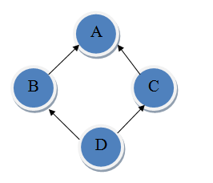

Diamond Inheritance
---

You are asked to help diagnose class diagrams to identify instances of diamond inheritance. The following example class diagram illustrates the property of diamond inheritance. There are four classes: A, B, C and D. An arrow pointing from X to Y indicates that class X inherits from class Y.

In this class diagram, D inherits from both B and C, B inherits from A, and C also inherits from A. An inheritance path from X to Y is defined as a sequence of classes X, C1, C2, C3, ..., Cn, Y where X inherits from C1, Ci  inherits from Ci + 1  for 1 ≤ i ≤ n - 1, and Cn  inherits from Y. There are two inheritance paths from D to A in the example above. The first path is D, B, A and the second path is D, C, A.

A class diagram is said to contain a diamond inheritance if there exists a pair of classes X and Y such that there are at least two different inheritance paths from X to Y. The above class diagram is a classic example of diamond inheritance. Your task is to determine whether or not a given class diagram contains a diamond inheritance.

### Input

The first line of the input gives the number of test cases,  **T**.  **T**  test cases follow, each specifies a class diagram. The first line of each test case gives the number of classes in this diagram,  **N**. The classes are numbered from 1 to  **N**.  **N**  lines follow. The ith  line starts with a non-negative integer  **Mi**  indicating the number of classes that class  _i_  inherits from. This is followed by  **Mi**  distinct positive integers each from 1 to  **N**  representing those classes. You may assume that:

-   If there is an inheritance path from X to Y then there is no inheritance path from Y to X.
-   A class will never inherit from itself.

### Output

For each diagram, output one line containing "Case #x: y", where x is the case number (starting from 1) and y is "Yes" if the class diagram contains a diamond inheritance, "No" otherwise.

### Limits

1 ≤  **T**  ≤ 50.  
0 ≤  **Mi**  ≤ 10.  

#### Small dataset

1 ≤  **N**  ≤ 50.

#### Large dataset

1 ≤  **N**  ≤ 1,000.

### Sample
  
#### Input  
    3
    3
    1 2
    1 3
    0
    5
    2 2 3
    1 4
    1 5
    1 5
    0
    3
    2 2 3
    1 3
    0
  
#### Output  
    Case #1: No
    Case #2: Yes
    Case #3: Yes

