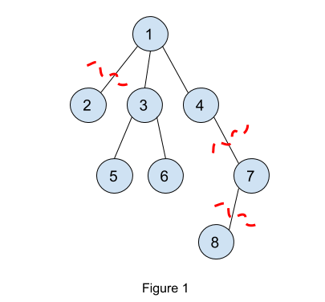
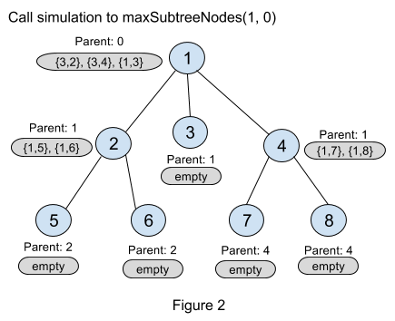
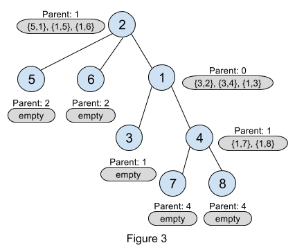

Problem B Analysis
---

### **Brute force algorithm:**

Given a tree with  **N**  nodes, there are  **2N**  subsets of nodes that can be deleted from the tree. The brute force algorithm is to simply check all possible node deletions and pick the one where the remaining nodes form a full binary tree and the number of nodes deleted is minimum. Note that when a set of nodes are deleted from the tree, the remaining nodes may not be a tree anymore (since the tree may become disconnected).

Let’s say there are  **M**  remaining nodes after deletion. One way to check whether the remaining nodes form a full binary tree is to first check whether it is still a tree. This can be done by performing a simple breadth-first or depth-first search to check that the remaining nodes are in one connected component. Next, we need to find a root in that tree where all its subtrees have either zero or two children. This leads to an O(**M2**) algorithm for checking if the remaining nodes form a full binary tree.

Another way to check whether a graph is a full binary tree is via counting which is linear O(**M**):

-   For the trivial case where  **M**  equals to 1, it is a full binary tree.
-   For  **M**  > 1, it must satisfy that there is exactly one node having degree two and the rest of the nodes must have degree either one or three. Also, the number of remaining edges must be equal to  **M - 1**  to signify that it is a tree, and not a disconnected graph.

Therefore, using different methods for checking whether the resulting graph is full binary tree or not you end up with a brute force algorithm that runs in O(**2N  * N2**) or O(**2N  * N**), which is sufficient to solve the small dataset. But it is not sufficient to solve the large dataset where  **N**  = 1000. In the following sections, we address the large dataset.

### **Quadratic algorithm:**

The insight to the quadratic algorithm is that minimizing the number of deleted nodes is equivalent to maximizing the number of nodes that are not deleted.

Let’s pick a root for the tree. The parent-child relationship is defined based on the chosen root. For each node, we will make a decision to delete it or keep it with the goal of maximizing the size of the full binary subtree. We now investigate the various cases for each node. If a node has only one child, then we have to remove that child (as it violates the full binary tree condition of having 0 or 2 children). Therefore, the size of that subtree is only  **one**  node (i.e. we only count the node itself). If it has more than one candidate children, we have to pick two of them as the children of the node. But which two? We pick the two which retain the maximum number of nodes in their own subtrees, which we will demonstrate later.

We can implement the above idea via a greedy post-order depth-first-traversal from a chosen root. During the traversal, we determine the maximum number of nodes we can retain in each subtree to form a full binary tree. The function  `maxSubtreeNodes(node, parent)`  is as follows:

-   The function’s parameters are the current node and its parent.
-   If the current node has 0 or 1 children then the number of nodes in this subtree is 1.
-   Otherwise, we have at least two subtrees and we should recursively call the function for each child of the current node. Remember, we want to maximize the number of nodes retained in the current node’s subtree, therefore we keep the two children that have the largest subtrees rooted at those children. We return the size of the two largest subtrees + 1 (1 to account the current node).

Finally, given this function the minimum number of nodes to be deleted for a given root node is:

```
N - maxSubtreeNodes(root, 0)  // 0 as the root does not have a parent.
```

We can run the  `maxSubtreeNodes(root, 0)`  function by picking each of the  **N**  nodes as the root. We pick the root node that minimizes  `N - maxSubtreeNodes(root, 0)`. As  `maxSubtreeNodes(root, 0)`  is a depth-first-traversal on a tree, it runs in O(**N**) time. Also, we run the traversal  **N**  times picking each node as the root. Therefore, the time complexity is O(**N2**).



Figure 1 shows an example where we demonstrate running  `maxSubtreeNodes(1, 0)`. Node 8 is deleted as it is the only child for node 7. Then node 7 is deleted for the same reason. After that, node 1 will have to choose only two children among nodes 2, 3, and 4. These 3 subtrees have sizes 1, 3, and 1, respectively. So node 1 will choose the maximum two subtrees which are nodes 3 and 4 (note we could choose node 2 instead of node 4 too). So for  `maxSubtreeNodes(1, 0)`, the maximum number of nodes to keep is 5 (nodes 1, 3, 4, 5, and 6). Equivalently, the minimum number of nodes to be deleted is 3 (nodes 2, 7 and 8).

Here is the pseudo-code for this algorithm:

```
minDeletions = infinity
for root = 1 to N:
  minDeletions = min(minDeletions, N - maxSubtreeNodes(root, 0))

def maxSubtreeNodes(currentNode, parent):
  maximumTwoNumbers = {}  // Structure that keeps track of 
  // the maximum two numbers.
  for x in neighbors of currentNode:
     if x == parent:
       continue
     update maximumTwoNumbers with maxSubtreeNodes(x, currentNode)
  if size of maximumTwoNumbers == 2:
    return 1 + sum(maximumTwoNumbers)
  return 1
```

### **Linear algorithm:**

The previous quadratic algorithm is sufficient to solve the large dataset but you might be interested in a solution with better time complexity. We present here a linear time algorithm which is based on the quadratic time algorithm.

In the quadratic algorithm, we take O(**N**) to compute the size of the largest two subtrees for any root node (remember, we brute force over all  **N**  possible root nodes). So our goal in the linear time algorithm is to compute the size of the largest two subtrees for any node in constant time. To do so, we will precompute the three largest children subtrees (not only two unlike in the quadratic algorithm). We will explain why we need three largest children in a subsequent paragraph.

So let's define our precomputation table structure. It is a one-dimensional array of objects called top3, which is defined as follows:

```
  class top3:
    class pair:
      int size
      int subtreeRoot
    pair children[3]  // children is sorted by the size value.
    int parent
```

In the greedy DFS function  `maxSubtreeNodes(node, parent)`, there are only  **2 * (N-1)**  different parameter pairs for the function (a parameter pair is the node, parent pair, and also there are exactly  **N-1**  edges in any tree). The key to our linear algorithm is to run DFS once on the given tree from some root node (say from node 1), and during this traversal for every node, to store the three largest subtrees among its children while also keeping track of the parent of the node. We will explain later why we need to keep track of the parent. This DFS traversal will be O(**N**) as it visits every node exactly once.



Figure 2 is an illustration figure for the stored top3 objects for every node after calling  `maxSubtreeNodes(1, 0)`. For node 2, {1, 5} means the subtree rooted at the child node 5 has maximum size 1, and “Parent: 1” means the parent of node 2 is 1.

But still after doing this precomputation there is something missing in our calculation. We assumed that node 1 is the root but in the original quadratic algorithm, we need to try all nodes as root. We now show how we can avoid having to try all nodes as root. In the function described above, for any node its parent is not considered as a candidate to be put in that node’s top3 children array. We now describe an example to show how we account for the parent of a particular node. In the example, we will use the parent’s information to update the top3 array for the current node.



We describe a local update process to fix the top3 array for node 2. Remember that node 2’s parent is node 1 (see Figure 2). Let us pretend that node 2 is picked as the root (shown in Figure 3). We then look at its parent’s (node 1’s) top3 array. Note that the top element in the top3 array for node 1 is in fact node 2! We update node 2’s top3 array using node 1’s top3 array, therefore we exclude the result for node 2 from node 1’s top3 array. After excluding node 2 from the top3 array of node 1, the resulting pair describing node 1 is {5, 1} (i.e. size of subtree rooted at node 1 excluding node 2 is 5: nodes 1, 3, 4, 7 and 8). We now update the top3 array for node 2 with {5,1}. Therefore, now node 2’s top3 array is: {5,1}, {1,5}, {1,6}, and the size of the largest full binary tree rooted at node 2 is 7 (5 + 1 from the first two children, and 1 to count node 2 itself).

We perform the local update process described in the previous paragraph in a pre-order depth-first-traversal starting from node 1. Note that when doing the local update, excluding the current node from its parent’s top3 array might result in an array with only one element. In such cases, the parent’s subtree (excluding the current node) should be of size 1.

Well, you might be still wondering why we need the three largest subtrees and not two. Observe in Figure 3, if we had stored only the top 2 instead of the top 3 subtrees in node 1 (meaning only {3,2} and {3,4}) and we excluded node 2 during the local update, then we will only have the pair {3,4} which describes node 4 but ignores node 3! This would be incorrect as node 3 is part of a full binary tree rooted at node 1. Therefore we keep information for the largest three subtrees.

